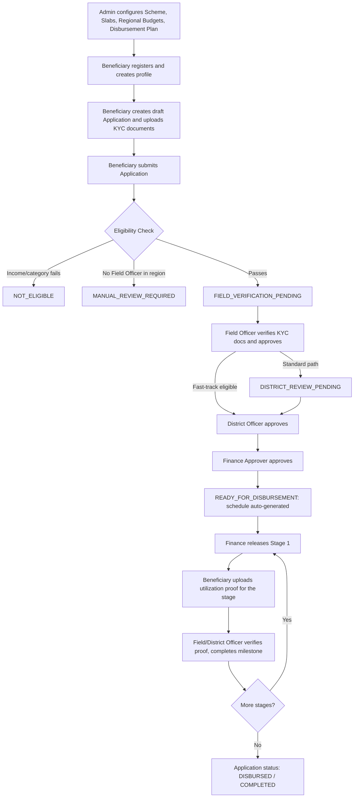
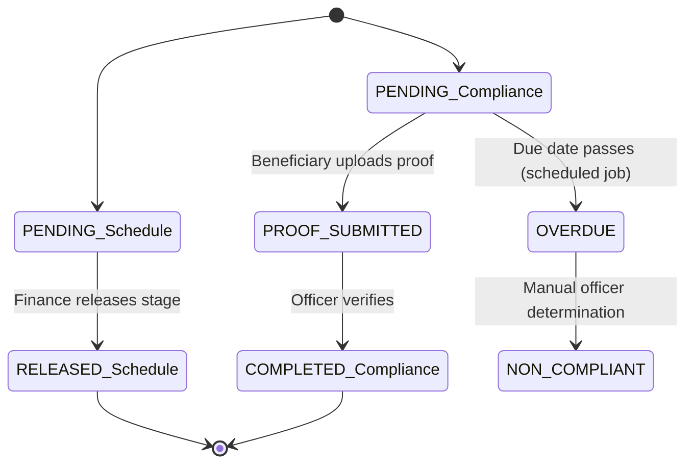
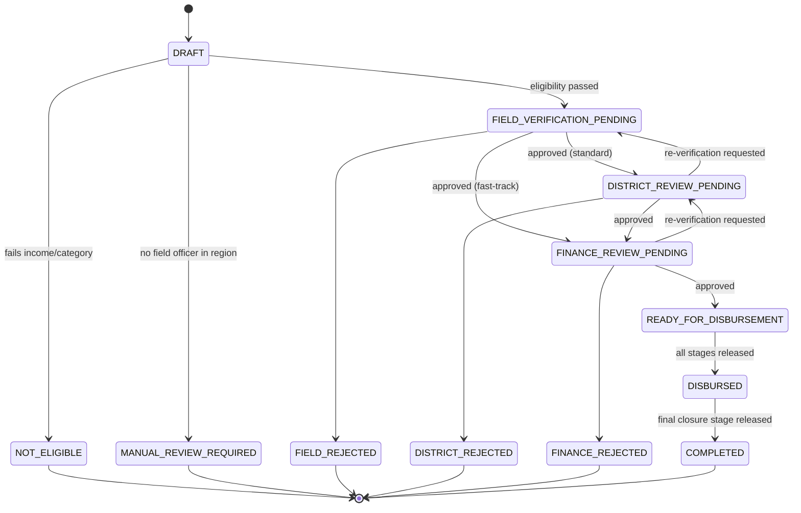

# Subsidy Tracker

**Development of Digital Subsidy and Grant Administration Platform**

🌐 **Live Demo:** [https://digital-subsidy-platform.web.app/](https://digital-subsidy-platform.web.app/)

A Java/Spring Boot backend that manages the full lifecycle of a government subsidy or grant — from scheme configuration and beneficiary application, through multi-level eligibility verification, to staged fund disbursement tied to compliance milestones, and regional fund-utilization analytics.

---

## Table of Contents

1. [Overview](#overview)
2. [Key Features](#key-features)
3. [User Roles & Responsibilities](#user-roles--responsibilities)
4. [End-to-End Workflow](#end-to-end-workflow)
5. [Staged Disbursement Model](#staged-disbursement-model)
6. [Security & Authorization](#security--authorization)
7. [Document Management](#document-management)
8. [Audit Logging](#audit-logging)
9. [External Integrations](#external-integrations)
10. [Database / Domain Model](#database--domain-model)
11. [Technology Stack](#technology-stack)
12. [Project Structure](#project-structure)
13. [Backend Architecture](#backend-architecture)
14. [API Overview](#api-overview)
15. [Application Status Flow](#application-status-flow)
16. [Disbursement & Compliance Statuses](#disbursement--compliance-statuses)
17. [Configuration](#configuration)
18. [Installation & Setup](#installation--setup)
19. [Running Tests](#running-tests)
20. [Design / Business Rules](#design--business-rules)
21. [Known Limitations](#known-limitations)
22. [Future Enhancements](#future-enhancements)

---

## Overview

Traditional subsidy and grant disbursement processes are typically manual: eligibility is checked by hand, verification records are fragmented across offices, approval standards vary between regions, and there is little visibility into how allocated funds are actually being used. This leads to delays, leakage risk, and poor transparency.

**Subsidy Tracker** is a role-based REST API that digitizes this process end-to-end:

- Beneficiaries apply for government schemes and track their own application status.
- Eligibility is calculated automatically against a scheme's income and category rules.
- Applications move through a **three-level verification chain** — Field Officer → District Officer → Finance Approver — with region-based routing.
- Approved applications receive an automatically generated **staged disbursement schedule**, where each stage releases funds only after the previous stage's utilization is verified.
- Administrators configure schemes, grant slabs, regional budgets, and disbursement plans.
- District Officers, Finance Approvers, and Admins get consolidated analytics (fund utilization by scheme/region, non-compliance, budget exhaustion warnings) and downloadable Excel/PDF reports.

The system is built as a single Spring Boot application, organized into feature packages (`beneficiary`, `scheme`, `eligibility`, `disbursement`, `analytics`, `dashboard`, `reports`, `security`, `integration`), backed by MySQL in production and H2 at runtime/test scope.

---

## Key Features

### Authentication & Security
- JWT-based authentication (stateless, no server-side sessions)
- BCrypt password hashing
- Role-based access control enforced centrally in `SecurityConfig`
- Server-resolved identity for all state-changing actions (client-supplied user/officer IDs are never trusted)
- Beneficiary ownership checks on applications and documents
- Region-based authorization for Field/District Officers; statewide access for Finance Approvers and Admins

### Beneficiary Management
- Self-registration (`BENEFICIARY` role is server-assigned)
- One beneficiary profile per user account
- Profile fields: category, region, annual income, contact details
- Scheme browsing (active schemes only, unless Admin)

### Application Lifecycle
- Draft-first application creation, followed by document upload, then formal submission
- Automatic eligibility scoring on submission
- Multi-level verification workflow with fast-track routing for low-risk applications
- Re-verification routing back to an earlier stage
- Application status history is fully attributable via `Verification` records

### Eligibility Engine
- Income-limit and category checks against `Scheme` configuration
- Missing-field-officer-in-region check (routes to manual review)
- Weighted eligibility score (income ratio + profile completeness)

### Staged Disbursement
- One `DisbursementPlan` per scheme, made up of ordered `DisbursementStage`s
- Automatic schedule generation once an application reaches `READY_FOR_DISBURSEMENT`
- Sequential, finance-controlled stage release (a stage cannot release before the previous stage's compliance is verified)
- Stage-specific utilization-proof upload and officer compliance verification
- Automatic application status advancement to `DISBURSED` / `COMPLETED`
- Scheduled daily job to flag overdue compliance milestones

### Administration
- Scheme, slab, and regional budget configuration
- Disbursement plan and stage configuration
- Officer self-registration with Admin approval workflow
- User listing for administrative oversight

### Analytics & Reporting
- Dashboard overview rollup (applications, budgets, overdue milestones)
- Fund utilization by scheme and by region
- Pending/overdue compliance milestone summary
- Non-compliance analysis by scheme and region
- Approval turnaround time (submission → Finance approval)
- Budget exhaustion warnings (OK / WARNING / CRITICAL)
- Beneficiary category distribution
- Downloadable Excel (Apache POI) and PDF (OpenPDF) scheme/region summary reports

---

## User Roles & Responsibilities

| Role | Responsibilities |
|---|---|
| **ADMIN** | Creates and updates schemes, scheme slabs, and regional budgets; configures disbursement plans and stages; approves/rejects officer registration requests; can view all schemes (including inactive) and all applications; can manually trigger eligibility recalculation; can complete compliance milestones. |
| **BENEFICIARY** | Registers an account and creates a beneficiary profile; browses active schemes; creates draft applications; uploads KYC documents and, later, stage-specific utilization proofs; formally submits applications for eligibility evaluation; views only their own applications, documents, and disbursement schedule. |
| **FIELD_OFFICER** | Verifies KYC documents for applications in their assigned region; approves, rejects, or requests re-verification at the Field stage; verifies utilization-proof documents and completes compliance milestones for applications in their region. |
| **DISTRICT_OFFICER** | Reviews applications that have passed Field verification, in their assigned region; approves, rejects, or requests re-verification; can complete compliance milestones in their region. |
| **FINANCE_APPROVER** | Reviews applications statewide (no regional restriction) after District approval; gives final approval, which triggers automatic disbursement-schedule generation; releases each disbursement stage in sequence; **cannot** complete compliance milestones (separation of duties from fund verification). |

Officer accounts (`FIELD_OFFICER`, `DISTRICT_OFFICER`, `FINANCE_APPROVER`) are not self-registered directly — a request is submitted via `/api/v1/auth/officer-register` and must be approved by an Admin before the account is created.

---

## End-to-End Workflow



### Step 1 — Admin Configures the Scheme
The Admin creates a `Scheme` (name, description, min/max income, comma-separated allowed categories, comma-separated required documents). The Admin then attaches one `SchemeSlab` per beneficiary category (defines the grant amount for that category) and one `RegionalBudget` per region (allocated budget for the scheme in that region). Finally, the Admin configures a single `DisbursementPlan` for the scheme, made up of ordered `DisbursementStage`s (each with a percentage of the grant, a trigger milestone, and a due-date offset). Stage percentages must total exactly 100%.

### Step 2 — Beneficiary Applies
A beneficiary registers (`POST /api/v1/auth/register`), creates a beneficiary profile (`POST /api/v1/beneficiaries`), and creates a draft application for a chosen active scheme (`POST /api/v1/applications`, status `DRAFT`). Required KYC documents (from `Scheme.requiredDocuments`) are uploaded via Cloudinary-backed file storage while the application is `DRAFT` or `RE_VERIFICATION_REQUIRED`.

### Step 3 — Submission & Eligibility
When the beneficiary calls `POST /api/v1/applications/{id}/submit`, the system first checks that every required document has been uploaded. If any are missing, submission is rejected and the application stays `DRAFT`. Otherwise, `EligibilityService` runs:
1. Income check against `Scheme.maxIncome`.
2. Category check against `Scheme.allowedCategories`.
3. A check that at least one `FIELD_OFFICER` is registered for the beneficiary's region.
4. If all checks pass, a weighted eligibility score is calculated and the application becomes `FIELD_VERIFICATION_PENDING`.

### Step 4 — Field Verification
A Field Officer whose `region` matches the beneficiary's region reviews the application. Every KYC document must be individually marked `VERIFIED` (`PATCH /documents/{documentId}/verify`) before the officer can approve. On approval, the routing engine checks whether the application qualifies for **fast-track** (eligibility score ≥ 80 and the applicable `SchemeSlab.grantAmount` ≤ 50,000) — if so, it skips District review and goes straight to `FINANCE_REVIEW_PENDING`; otherwise it goes to `DISTRICT_REVIEW_PENDING`.

### Step 5 — District Review
A District Officer whose region matches the beneficiary reviews the Field Officer's decision and either approves (→ `FINANCE_REVIEW_PENDING`), rejects (→ `DISTRICT_REJECTED`), or requests re-verification (→ back to `FIELD_VERIFICATION_PENDING`).

### Step 6 — Finance Approval
A Finance Approver (statewide, no region restriction) gives the final approval. This moves the application to `READY_FOR_DISBURSEMENT` and, in the same transaction, automatically triggers `ScheduleGenerationService.generateSchedule()`.

### Step 7 — Schedule Generation
The grant amount is resolved from the `SchemeSlab` matching the scheme and the beneficiary's category. For each ordered `DisbursementStage`, an `ApplicationDisbursementSchedule` row is created with `scheduledAmount = grantAmount × stage.percentageOfGrant / 100` and a staggered due date. A `DisbursementMilestone` is created for every schedule entry (status `PENDING` / `NOT_RELEASED`).

### Step 8 — Stage Release
A Finance Approver or Admin releases a stage (`POST /api/disbursement/schedules/{scheduleId}/release`). The first stage can be released immediately; every subsequent stage requires the **previous** stage to already be `RELEASED` **and** its corresponding milestone to already be `COMPLETED`. Releasing a stage also adds the released amount to the matching `RegionalBudget.utilizedBudget`.

### Step 9 — Utilization Proof
Once a stage is released, the beneficiary uploads a stage-linked utilization proof document (`stageId` supplied on upload). This sets the corresponding milestone's `complianceStatus` to `PROOF_SUBMITTED`.

### Step 10 — Compliance Verification
A Field or District Officer whose region matches the beneficiary (or an Admin) verifies the proof and completes the milestone (`PUT /api/disbursement/compliance/{milestoneId}/complete`). This requires the stage to already be `RELEASED` and a proof document to exist. **Finance Approvers are explicitly barred** from completing milestones, keeping fund release and compliance verification as separate duties.

### Step 11 — Next Stage / Completion
Completing a milestone unlocks release of the next stage (Step 8 repeats). Once every stage's schedule is `RELEASED`, the application status automatically advances: to `COMPLETED` if the final stage's trigger milestone is `PROJECT_CLOSURE`, otherwise to `DISBURSED`.

A daily scheduled job (`@Scheduled`, 1:00 AM) automatically flags any `PENDING` milestone whose due date has passed as `OVERDUE`.

---

## Staged Disbursement Model

Disbursement is never a single lump-sum payment. It is split into ordered stages, each tied to a compliance condition.

| Concept | Entity | Meaning |
|---|---|---|
| **Disbursement Plan** | `DisbursementPlan` | One per `Scheme`. Defines how many stages exist and who created the plan. |
| **Disbursement Stage** | `DisbursementStage` | A single configured stage of the plan: name, sequence number, percentage of the total grant, trigger milestone, and due-date offset. Percentages across all stages of a plan must total 100%. |
| **Schedule Entry** | `ApplicationDisbursementSchedule` | A concrete, per-application instantiation of a stage: the actual `scheduledAmount` in currency and a real `dueDate`. Tracks whether the **money** has moved (`DisbursementScheduleStatus`: `PENDING`, `RELEASED`, `ON_HOLD`). |
| **Compliance Milestone** | `DisbursementMilestone` | Tracks whether the **compliance condition** for a schedule entry has been met (`ComplianceStatus`: `PENDING`, `PROOF_SUBMITTED`, `COMPLETED`, `OVERDUE`, `NON_COMPLIANT`) and whether the funds for it have been released (`DisbursementStatus`: `NOT_RELEASED`, `RELEASED`). |

These three concepts are deliberately kept separate:

- **Schedule status** (`ApplicationDisbursementSchedule.status`) — has the money actually been released for this stage?
- **Compliance status** (`DisbursementMilestone.complianceStatus`) — has the beneficiary satisfied the condition (documentation, ground verification, utilization proof) for this stage?
- **Application status** (`Application.status`) — the overall lifecycle position of the application (e.g. `READY_FOR_DISBURSEMENT`, `DISBURSED`, `COMPLETED`).



A stage's schedule can only be released once the **previous** stage's schedule is `RELEASED` **and** the previous stage's milestone is `COMPLETED`. When every stage's schedule reaches `RELEASED`, the parent `Application` advances to `DISBURSED` (or `COMPLETED` if the final stage's `TriggerMilestone` is `PROJECT_CLOSURE`).

---

## Security & Authorization

- **Spring Security** with a fully stateless (`SessionCreationPolicy.STATELESS`) filter chain; HTTP Basic is disabled.
- **JWT** (`io.jsonwebtoken` / jjwt) issued on successful login or registration, carrying the user's email as subject and role as a claim. `JwtAuthenticationFilter` validates the token on every request and populates the `SecurityContext`.
- **Password hashing** via `BCryptPasswordEncoder`.
- **Role-based endpoint authorization** is centralized in `SecurityConfig` using URL-pattern matchers (`hasRole` / `hasAnyRole`) rather than scattered `@PreAuthorize` annotations — for example, scheme writes are `ADMIN`-only, verification actions are restricted to officer roles, and analytics/reports are restricted to `DISTRICT_OFFICER`, `FINANCE_APPROVER`, and `ADMIN`.
- **Server-resolved identity**: controllers resolve the acting user's ID from the authenticated `Authentication` principal (email → `User` lookup), never from client-supplied request fields. This prevents impersonation (e.g. the old `officerId` field was removed from `VerificationRequestDto` for exactly this reason).
- **Ownership checks**: beneficiaries can only view/act on their own applications, documents, and disbursement schedules (`ApplicationService`, `DocumentService`, `DisbursementController`, `ComplianceMilestoneController`).
- **Regional authorization**: `FIELD_OFFICER` and `DISTRICT_OFFICER` actions are restricted to applications whose beneficiary region matches the officer's own `region`. `FINANCE_APPROVER` and `ADMIN` operate statewide.
- **Separation of duties**: `FINANCE_APPROVER` can release disbursement stages but is explicitly blocked from completing compliance milestones.
- **CORS** is configured for the known frontend origins (Firebase-hosted portal and localhost).

Request flow:

```text
Login (/api/v1/auth/login)
  → JWT issued (email + role claim)
  → JWT sent in Authorization: Bearer <token> header on subsequent requests
  → JwtAuthenticationFilter validates token, sets SecurityContext
  → SecurityConfig URL matcher checks role
  → Controller resolves acting user from Authentication principal
  → Service layer enforces ownership / region / business-rule checks
```

---

## Document Management

Two distinct categories of documents exist, both backed by the `Document` entity and stored via Cloudinary:

- **KYC documents** (`Document.stage == null`) — uploaded by the beneficiary while an application is `DRAFT` or `RE_VERIFICATION_REQUIRED`, matched against `Scheme.requiredDocuments`. Verified individually by the Field Officer (`DocumentVerificationStatus`: `PENDING`, `VERIFIED`, `REJECTED`) before a Field-level approval is allowed.
- **Stage utilization proofs** (`Document.stage != null`) — uploaded by the beneficiary only after the corresponding disbursement stage has been `RELEASED`, and only once per stage (re-upload is blocked once the milestone is already `COMPLETED`). These are verified through the compliance milestone workflow (`ComplianceMilestoneService`), not the KYC verification endpoint.

**Cloud storage backend:** All document uploads are persisted to **Cloudinary**, the project's cloud file/media storage service, rather than to local disk. `CloudinaryConfig` (`common/config`) constructs the Cloudinary client from configured credentials, and `CloudinaryService` (`common/service`) wraps the upload call:

- On upload, `DocumentService.uploadDocument()` sends the incoming file's bytes to Cloudinary via `CloudinaryService.upload()`, which stores the asset under the `Subsidy Tracker/documents` Cloudinary folder and returns a secure HTTPS `secure_url`. This URL — not a local file path — is what's persisted on the `Document` entity's `filePath` field.
- On retrieval, `DocumentController.getFile()` checks whether the stored `filePath` is an `http://`/`https://` URL; for Cloudinary-hosted documents it redirects the caller directly to that secure URL (HTTP 302) rather than streaming bytes from local disk. A local-filesystem fallback path exists in the same method for any pre-Cloudinary records, but new uploads always go through Cloudinary.
- Upload failures from Cloudinary are surfaced as an `InvalidOperationException` rather than a raw I/O exception.

This applies uniformly to both KYC documents and stage-linked utilization proofs — both document categories go through the same `CloudinaryService.upload()` path.

Access control (`DocumentService.checkDocumentAccess`):
- **Beneficiary** — only their own application's documents.
- **Field/District Officer** — documents for applications currently at their review stage, in their region; during the disbursement phase they may view stage-linked proofs only (KYC documents are hidden once verification has moved on).
- **Finance Approver** — documents for applications at `FINANCE_REVIEW_PENDING`, statewide.
- **Admin** — full access.

A dedicated download endpoint (`GET /documents/{documentId}/file`) streams the file (redirecting to the Cloudinary URL) after applying the same access rules.

---

## Audit Logging

`AuditLogService` writes an `AuditLog` row (entity name, entity ID, action, actor, timestamp, free-text details) for the following state-changing events:

- Officer registration approval/rejection
- Every verification decision (`APPROVED`, `REJECTED`, `RE_VERIFICATION_REQUESTED`) at Field/District/Finance level
- KYC document verification (`DOCUMENT_VERIFIED` / `DOCUMENT_REJECTED` / `DOCUMENT_PENDING`)
- Application submission
- Disbursement schedule generation
- Disbursement stage release
- Compliance milestone completion
- Compliance milestone becoming overdue (system-generated event, no actor)
- Treasury disbursement dispatch

Audit-log writes are wrapped so that a logging failure never blocks the underlying business operation (failures are logged as warnings, not thrown). This module is additive and does not currently cover every read/write endpoint in the system — see [Known Limitations](#known-limitations).

---

## External Integrations

- **Beneficiary Registry Integration** (`/api/v1/integrations/beneficiary/validate`) — calls a pluggable `BeneficiaryRegistryClient`; the current implementation talks to an in-app mock endpoint (`/mock/external-registry/validate`) that returns a hardcoded validation result. This is a standalone validation endpoint and is not currently invoked automatically during beneficiary profile creation.
- **Treasury Integration** (`/api/v1/integrations/treasury/disburse`, `FINANCE_APPROVER`/`ADMIN` only) — calls a pluggable `TreasuryClient`; the current implementation talks to an in-app mock endpoint (`/mock/external-treasury/disburse`) that simulates a treasury transaction ID. This endpoint is implemented and audit-logged, but is a separate, manually-invoked integration point — it is not automatically called as part of the `releaseStage` disbursement flow.

Both mock controllers exist purely to exercise the integration clients in local development/testing without a real external system.

---

## Database / Domain Model

| Entity | Purpose |
|---|---|
| `User` | System account for officers, admins, and beneficiaries; holds email, hashed password, role, and (for regional roles) a region. |
| `Beneficiary` | The person a scheme benefits; linked one-to-one to a `User` account; holds category, region, income, and contact details. |
| `Scheme` | A government subsidy/grant program; holds income limits, allowed categories, required documents, and active flag. |
| `SchemeSlab` | Grant amount for a scheme, per `BeneficiaryCategory`. |
| `RegionalBudget` | Allocated vs. utilized budget for a scheme, per region. |
| `Application` | The event of a beneficiary applying to a scheme; carries `ApplicationStatus`, eligibility score, submission date, and remarks. |
| `Document` | An uploaded file — either a KYC document (`stage == null`) or a stage-linked utilization proof. |
| `Verification` | An immutable record of one officer's decision at one verification level for one application. |
| `DisbursementPlan` | The scheme-level configuration of how many disbursement stages exist. |
| `DisbursementStage` | One configured stage of a plan (percentage, sequence, trigger milestone, due-date offset). |
| `ApplicationDisbursementSchedule` | A per-application instantiation of a stage, with the actual scheduled amount, due date, and release status. |
| `DisbursementMilestone` | Tracks the compliance status and disbursement status for one schedule entry. |
| `OfficerRegistrationRequest` | A pending request from a prospective officer, awaiting Admin approval. |
| `AuditLog` | Immutable audit trail entry for a state-changing action. |

Key relationships: one `User` ↔ one `Beneficiary`; one `Beneficiary` → many `Application`s; one `Scheme` → many `SchemeSlab`s and `RegionalBudget`s; one `Scheme` → one `DisbursementPlan` → many `DisbursementStage`s; one `Application` → many `ApplicationDisbursementSchedule`s and `DisbursementMilestone`s (one pair per stage); one `Application` → many `Document`s and `Verification`s.

---

## Technology Stack

| Layer | Technology |
|---|---|
| Language / Runtime | Java 17 |
| Backend Framework | Spring Boot 3.5.16 (Spring Web, Spring Data JPA, Spring Security, Spring Validation, Spring Scheduling) |
| Database (production) | MySQL 8.0.x |
| Database (runtime/test) | H2 (in-memory) |
| Authentication | JWT (`io.jsonwebtoken` / jjwt 0.11.5) + BCrypt |
| Build Tool | Maven (with Maven Wrapper, `mvnw` / `mvnw.cmd`) |
| ORM | Hibernate via Spring Data JPA |
| File Storage | Cloudinary (document uploads) |
| Reporting | Apache POI (`poi-ooxml`, Excel) and OpenPDF (PDF) |
| Frontend (portal) | Static HTML/CSS/JS served from `src/main/resources/static/portal`, deployed via Firebase Hosting |
| Frontend (dashboard) | Static HTML page (`static/dashboard/index.html`) calling the analytics/report APIs directly |
| Environment Config | `spring-dotenv` (`.env` support) plus git-ignored `application-local.properties` |
| Deployment | Docker (`Dockerfile`), Render (`render.yaml`), Firebase Hosting (portal only) |
| API Style | REST (JSON), versioned under `/api/v1` for core resources and `/api/disbursement` for the disbursement module |

---

## Project Structure

```text
subsidy-tracker/
├── src/
│   ├── main/
│   │   ├── java/com/subsidytracker/
│   │   │   ├── analytics/            # Fund utilization & compliance analytics service
│   │   │   ├── beneficiary/          # Beneficiary profile CRUD
│   │   │   ├── common/               # Shared entities, enums, exceptions, security config, audit
│   │   │   ├── dashboard/            # Dashboard DTOs + AnalyticsDataSource abstraction
│   │   │   ├── disbursement/         # Disbursement plans, stages, schedules, compliance milestones
│   │   │   ├── eligibility/          # Applications, eligibility scoring, verification, documents
│   │   │   ├── integration/          # Beneficiary registry & treasury client integrations (+ mocks)
│   │   │   ├── reports/              # Excel/PDF report generation
│   │   │   ├── scheme/               # Scheme, slab, regional budget management
│   │   │   ├── security/             # Auth, JWT, officer registration
│   │   │   ├── user/                 # Lightweight "who am I" / user listing endpoints
│   │   │   └── SubsidyTrackerApplication.java
│   │   └── resources/
│   │       ├── static/portal/        # Beneficiary-facing static portal (Firebase-hosted)
│   │       ├── static/dashboard/     # Officer/analytics dashboard page
│   │       └── application*.properties
│   └── test/
├── docs/                              # Design docs, workflow specs, API/analytics documentation
├── Dockerfile
├── render.yaml
├── firebase.json
├── pom.xml
└── README.md
```

---

## Backend Architecture

Each module follows a conventional layered structure:

```text
Controller  (REST endpoints, request/response DTOs, auth-principal resolution)
    ↓
Service     (business rules, transactions, orchestration across repositories)
    ↓
Repository  (Spring Data JPA interfaces)
    ↓
Entity / Database
```

Notable cross-cutting collaborators:
- `AuditLogService` — injected into services that perform state-changing actions.
- `GlobalExceptionHandler` — maps `ResourceNotFoundException` (404), `InvalidOperationException` (400), Spring `AuthenticationException` (401), and any other exception (500) to a consistent JSON error body.
- `AnalyticsDataSource` — an interface the `dashboard`/`reports` packages depend on; `RealAnalyticsDataSourceAdapter` (marked `@Primary`) delegates to the real `AnalyticsService`, keeping reporting decoupled from the analytics implementation.
- `ScheduleGenerationService` and `ComplianceMilestoneService` — the two services that drive the staged-disbursement state machine described above.

---

## API Overview

All endpoints are prefixed `/api/v1` (core resources) except the disbursement module, which uses `/api/disbursement`.

### Authentication

| Method | Endpoint | Purpose |
|---|---|---|
| POST | `/api/v1/auth/register` | Register a beneficiary account |
| POST | `/api/v1/auth/officer-register` | Submit an officer registration request (pending Admin approval) |
| POST | `/api/v1/auth/login` | Authenticate and receive a JWT |

### Users & Officer Administration

| Method | Endpoint | Purpose |
|---|---|---|
| GET | `/api/v1/users/me` | Get the authenticated user's identity/role/region |
| GET | `/api/v1/users` | List all users (Admin) |
| GET | `/api/v1/admin/officer-registration-requests` | List pending officer requests (Admin) |
| GET | `/api/v1/admin/officer-registration-requests/all` | List all officer requests (Admin) |
| POST | `/api/v1/admin/officer-registration-requests/{id}/approve` | Approve an officer request (Admin) |
| POST | `/api/v1/admin/officer-registration-requests/{id}/reject` | Reject an officer request (Admin) |

### Beneficiaries

| Method | Endpoint | Purpose |
|---|---|---|
| POST | `/api/v1/beneficiaries` | Create the caller's beneficiary profile |
| GET | `/api/v1/beneficiaries/me` | Get the caller's own beneficiary profile |
| GET | `/api/v1/beneficiaries/{id}` | Get a beneficiary by ID |
| GET | `/api/v1/beneficiaries` | List/paginate beneficiaries |
| PUT | `/api/v1/beneficiaries/{id}` | Update a beneficiary profile (owner or Admin) |

### Schemes

| Method | Endpoint | Purpose |
|---|---|---|
| POST | `/api/v1/schemes` | Create a scheme (Admin) |
| GET | `/api/v1/schemes/{id}` | Get a scheme (inactive schemes hidden from non-admins) |
| GET | `/api/v1/schemes` | List schemes (active-only for non-admins) |
| PUT | `/api/v1/schemes/{id}` | Update a scheme (Admin) |
| POST | `/api/v1/schemes/{id}/slabs` | Add a grant slab for a category (Admin) |
| GET | `/api/v1/schemes/{id}/slabs` | List slabs for a scheme |
| POST | `/api/v1/schemes/{id}/regional-budgets` | Allocate a regional budget (Admin) |
| GET | `/api/v1/schemes/{id}/regional-budgets` | List regional budgets for a scheme |

### Applications

| Method | Endpoint | Purpose |
|---|---|---|
| POST | `/api/v1/applications` | Create a draft application (Beneficiary) |
| GET | `/api/v1/applications/my-applications` | List the caller's own applications |
| POST | `/api/v1/applications/{id}/submit` | Submit a draft application for eligibility evaluation |
| GET | `/api/v1/applications/{id}` | Get an application (ownership enforced for beneficiaries) |
| GET | `/api/v1/applications` | List/paginate all applications |
| GET | `/api/v1/applications/status/{status}` | List applications by status (officers/Admin) |
| POST | `/api/v1/applications/{applicationId}/calculate-eligibility` | Manually recalculate eligibility (Admin) |
| PATCH | `/api/v1/applications/{applicationId}/verify` | Record a Field/District/Finance verification decision |

### Documents

| Method | Endpoint | Purpose |
|---|---|---|
| POST | `/api/v1/applications/{applicationId}/documents` | Upload a KYC document or (with `stageId`) a utilization proof |
| GET | `/api/v1/applications/{applicationId}/documents` | List documents for an application (role/region scoped) |
| GET | `/api/v1/applications/{applicationId}/documents/{documentId}/file` | Download/view a document's file |
| PATCH | `/api/v1/applications/{applicationId}/documents/{documentId}/verify` | Verify/reject a KYC document (Field Officer) |

### Disbursement

| Method | Endpoint | Purpose |
|---|---|---|
| POST | `/api/disbursement/plans` | Create a disbursement plan for a scheme (Admin) |
| PUT | `/api/disbursement/plans/{planId}` | Replace a plan's stages (Admin) |
| DELETE | `/api/disbursement/plans/{planId}` | Delete a plan (Admin) |
| GET | `/api/disbursement/plans/{planId}` | Get a plan by ID |
| GET | `/api/disbursement/plans/scheme/{schemeId}` | Get a plan by scheme |
| POST | `/api/disbursement/schedules/generate/{applicationId}` | Manually (re-)trigger schedule generation |
| POST | `/api/disbursement/schedules/{scheduleId}/release` | Release a stage's funds (Finance/Admin) |
| GET | `/api/disbursement/schedules/application/{applicationId}` | Get an application's disbursement schedule |

### Compliance

| Method | Endpoint | Purpose |
|---|---|---|
| POST | `/api/disbursement/compliance/application/{applicationId}` | Create compliance milestones from a schedule (Admin) |
| GET | `/api/disbursement/compliance/application/{applicationId}` | List milestones for an application (ownership enforced) |
| PUT | `/api/disbursement/compliance/{milestoneId}/complete` | Mark a milestone compliant (Field/District Officer, Admin) |
| GET | `/api/disbursement/compliance/pending` | List pending milestones (officers/Admin) |
| GET | `/api/disbursement/compliance/overdue` | List overdue milestones (officers/Admin) |

### Analytics & Reports

| Method | Endpoint | Purpose |
|---|---|---|
| GET | `/api/v1/analytics/overview` | Dashboard stat-card rollup |
| GET | `/api/v1/analytics/fund-utilization/schemes` | Fund utilization by scheme |
| GET | `/api/v1/analytics/fund-utilization/regions` | Fund utilization by region |
| GET | `/api/v1/analytics/compliance/pending-milestones` | Pending/overdue/completed milestone counts |
| GET | `/api/v1/analytics/compliance/non-compliance` | Non-compliance counts by scheme/region |
| GET | `/api/v1/analytics/approval-turnaround` | Average/fastest/slowest approval turnaround |
| GET | `/api/v1/analytics/budget-exhaustion-warnings` | Budget exhaustion severity by scheme/region |
| GET | `/api/v1/analytics/beneficiary-category-distribution` | Beneficiary counts by category |
| GET | `/api/v1/reports/schemes/excel` \| `/schemes/pdf` | Scheme-wise utilization report download |
| GET | `/api/v1/reports/regions/excel` \| `/regions/pdf` | Regional utilization report download |

### Integrations

| Method | Endpoint | Purpose |
|---|---|---|
| POST | `/api/v1/integrations/beneficiary/validate` | Validate a beneficiary against the external registry (mocked) |
| POST | `/api/v1/integrations/treasury/disburse` | Dispatch a disbursement order to the treasury system (mocked) |

---

## Application Status Flow



The `ApplicationStatus` enum additionally defines `SUBMITTED`, `ELIGIBILITY_PENDING`, `ELIGIBLE`, `RE_VERIFICATION_REQUIRED`, and `APPLICATION_CANCELLED` values reserved for the model but not currently produced by the implemented service logic described above.

---

## Disbursement & Compliance Statuses

**`DisbursementScheduleStatus`** (has the money moved for this stage?):
- `PENDING` — scheduled, not yet released
- `RELEASED` — funds released to this stage
- `ON_HOLD` — reserved value; not currently set by implemented logic

**`ComplianceStatus`** (has the beneficiary satisfied the stage's condition?):
- `PENDING` — condition not yet met
- `PROOF_SUBMITTED` — beneficiary has uploaded utilization proof, awaiting officer verification
- `COMPLETED` — an officer has verified the proof
- `OVERDUE` — due date passed while still `PENDING` (set automatically by the daily scheduled job)
- `NON_COMPLIANT` — reserved for a manual determination that the requirement will not be met; not currently set automatically

**`DisbursementStatus`** (per-milestone mirror of schedule release):
- `NOT_RELEASED`
- `RELEASED`

**`MilestoneType`** (nature of the compliance requirement): `DOCUMENTATION`, `GROUND_VERIFICATION`, `UTILIZATION_PROOF`

**`TriggerMilestone`** (configured on a `DisbursementStage`): `APPLICATION_APPROVAL`, `GROUND_VERIFICATION`, `UTILIZATION_PROOF`, `PROJECT_CLOSURE`

---

## Configuration

Configuration is split between committed defaults (`application.properties`) and a git-ignored local override file. Populate the following (placeholder values only):

```properties
# src/main/resources/application-local.properties
spring.datasource.url=jdbc:mysql://localhost:3306/subsidy_tracker_db?createDatabaseIfNotExist=true&useSSL=false&allowPublicKeyRetrieval=true&serverTimezone=UTC
spring.datasource.username=<your-mysql-username>
spring.datasource.password=<your-mysql-password>
spring.datasource.driver-class-name=com.mysql.cj.jdbc.Driver
```

Or, via a git-ignored `.env` file (see `.env.example`):

```text
DB_URL=jdbc:mysql://localhost:3306/subsidy_tracker_db?createDatabaseIfNotExist=true&useSSL=false&allowPublicKeyRetrieval=true&serverTimezone=UTC
DB_USERNAME=<your-username>
DB_PASSWORD=<your-password>
DB_DRIVER=com.mysql.cj.jdbc.Driver

JWT_SECRET=<your-jwt-secret-min-256-bits>
JWT_EXPIRATION=86400000

CLOUDINARY_CLOUD_NAME=<your-cloud-name>
CLOUDINARY_API_KEY=<your-api-key>
CLOUDINARY_API_SECRET=<your-api-secret>
```

- `jwt.secret` / `jwt.expiration` — JWT signing key and token lifetime (defaults exist for local development only; override for anything beyond local use).
- `cloudinary.*` — required for document upload; defaults to a non-functional `test-stub` value.
- `treasury.mock.base-url` — base URL for the mock treasury client (defaults to the in-app mock endpoint).
- Application runs on port `8080` by default.

**Never commit real database credentials, JWT secrets, or Cloudinary keys.** `application-local.properties` and `.env` are already listed in `.gitignore`.

---

## Installation & Setup

1. **Clone the repository and switch to the integration branch**
   ```bash
   git clone <repo-url>
   cd subsidy-tracker
   git checkout dev
   git pull origin dev
   ```

2. **Install and start MySQL 8.0.x**, then create the database:
   ```sql
   CREATE DATABASE subsidy_tracker_db;
   ```

3. **Configure local settings** — create `src/main/resources/application-local.properties` (see [Configuration](#configuration) above) or a `.env` file based on `.env.example`.

4. **Build and run**
   ```bash
   ./mvnw spring-boot:run
   ```
   On Windows:
   ```powershell
   .\mvnw.cmd spring-boot:run
   ```

5. **Verify startup** — the log should end with `Started SubsidyTrackerApplication...`, and Hibernate should create all tables in `subsidy_tracker_db`.

6. **Register an account and get a token**
   ```bash
   curl -X POST http://localhost:8080/api/v1/auth/register \
     -H "Content-Type: application/json" \
     -d '{"fullName":"Your Name","email":"you@test.com","password":"test1234"}'
   ```
   Then:
   ```bash
   curl -X POST http://localhost:8080/api/v1/auth/login \
     -H "Content-Type: application/json" \
     -d '{"email":"you@test.com","password":"test1234"}'
   ```
   Use the returned `token` as `Authorization: Bearer <token>` on subsequent requests.

7. **View the analytics dashboard** at `http://localhost:8080/dashboard/index.html`, pasting in your token.

---

## Running Tests

```bash
./mvnw test
```

On Windows:
```powershell
.\mvnw.cmd test
```

Unit tests exist for the disbursement module (`DisbursementPlanServiceTest`, `ScheduleGenerationServiceTest`), written with JUnit and Mockito, covering plan creation/validation, schedule generation, duplicate-prevention, and exception paths.

---

## Design / Business Rules

- Beneficiaries can only create/submit/view applications and documents they own; `beneficiaryId` is always server-resolved from the authenticated account, never client-supplied.
- An application cannot be submitted until every document in `Scheme.requiredDocuments` has been uploaded.
- A Field-level approval cannot be recorded until every KYC document on the application is individually marked `VERIFIED`.
- Field and District Officer actions require the officer's `region` to match the beneficiary's `region`; Finance Approvers and Admins act statewide.
- Fast-track routing (skipping District review) requires eligibility score ≥ 80 **and** the applicable slab's grant amount ≤ 50,000; if no matching slab exists, the application is conservatively **not** fast-tracked.
- Re-verification requests route back to the level below the requester (District doubts Field's work → back to Field; Finance doubts District's work → back to District).
- Only `FINANCE_APPROVER` or `ADMIN` may release a disbursement stage.
- A stage cannot be released until the previous stage's schedule is `RELEASED` **and** its milestone is `COMPLETED`.
- A stage-linked utilization proof can only be uploaded after that stage has been released, and cannot be re-uploaded once the milestone is already `COMPLETED`.
- `FINANCE_APPROVER` is explicitly prohibited from completing compliance milestones.
- Core records (`Beneficiary`, `Scheme`, `Application`) are never hard-deleted, to preserve the audit trail; deactivation (`isActive = false`) is used for schemes instead.
- Region is modeled as a flat string on `User`/`Beneficiary`/`RegionalBudget` — there is no hierarchical Region entity (State → District → Block); this is a deliberate, documented simplification (see `docs/regional-hierarchy.md`).

---

## Known Limitations

- `DisbursementScheduleStatus.ON_HOLD` and `ComplianceStatus.NON_COMPLIANT` are defined in the model but are not currently set by any implemented service logic — they exist for future manual-intervention workflows.
- The `ApplicationStatus` values `SUBMITTED`, `ELIGIBILITY_PENDING`, `ELIGIBLE`, `RE_VERIFICATION_REQUIRED`, and `APPLICATION_CANCELLED` are defined but not produced by the current eligibility/verification service logic.
- The beneficiary-registry and treasury integrations are implemented against in-app mocks and are not automatically invoked from the main application/disbursement workflows — they are standalone endpoints intended to demonstrate the integration pattern.
- Fast-track routing thresholds (score ≥ 80, grant ≤ 50,000) are hardcoded constants rather than per-scheme configuration.
- Audit logging covers the major state-changing actions listed in [Audit Logging](#audit-logging) but is not exhaustively applied to every endpoint in the system.
- Disbursement stage `dueDate` is computed with a fixed 7-day-per-stage offset; a configurable disbursement-timing policy is not yet implemented.

---

## Future Enhancements

*The following are potential future improvements, not implemented functionality:*

- A self-referential `Region` entity for true geographic hierarchy (State → District → Block) instead of flat region strings.
- Per-scheme configurable fast-track thresholds instead of hardcoded constants.
- Automatically wiring the treasury integration into the stage-release flow.
- Configurable milestone sets per scheme instead of a shared three-stage enum.
- Database-level enforcement (trigger/check constraint) that a schedule's stage amounts sum to the slab's grant amount, in addition to the existing service-layer validation.
